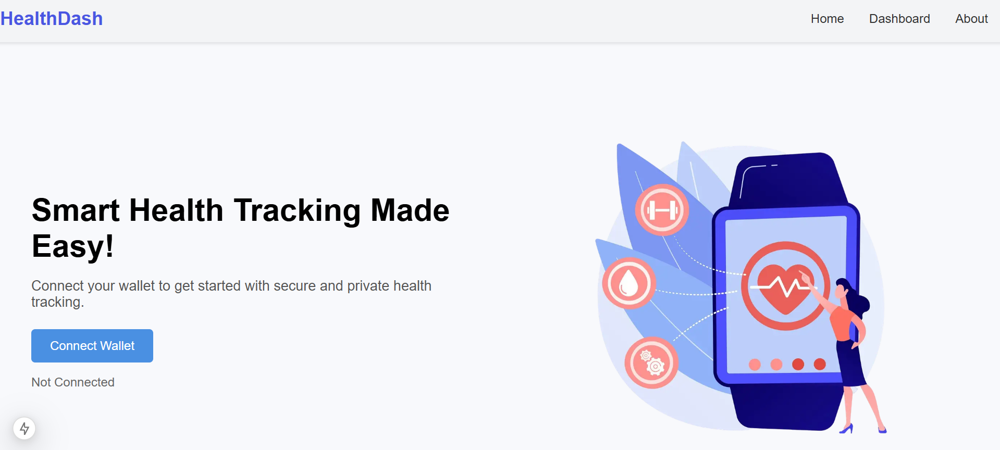
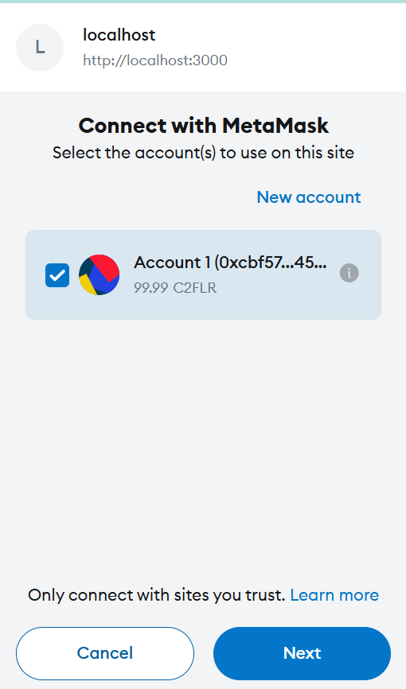
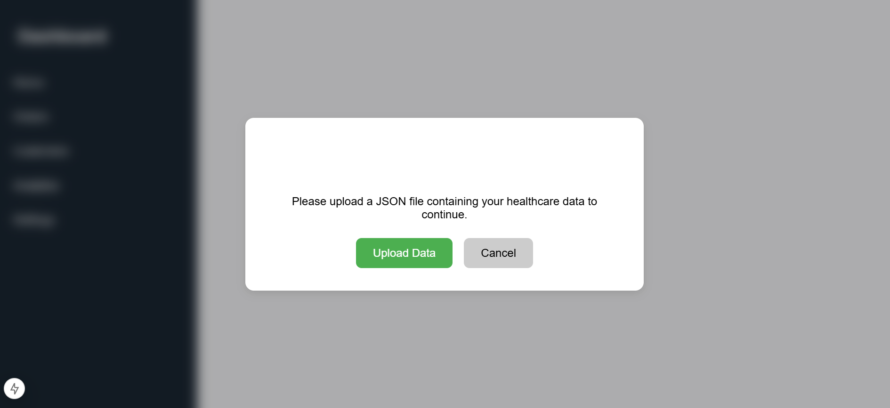

# Welcome to **Sepia!**
**Sepia** is a secure framework designed to handle user data encryption, storage, and processing using Fully Homomorphic Encryption (FHE) integrated with the Flare Network's Data Connector for validation. This repository contains the core components of the Sepia technology.

## Key Features:
- Agent Validation using the FDC
- Fully Homomorphic Encryption of data during processing
- Support for AI Processing
### How does Sepia Work?
Sepia works by encrypting input data by users and storing it on an external repository

## Demo Usage

The demo we have provided is a stress tracker which uses an AI Agent to process inputted health data. Usage steps are below: 

1. Download the dataset file:
2. Run the app and login using your favourite wallet (this example uses MetaMask):



3. Upload the dataset JSON:

4. The app provides a stepper for you to view the backend's processes in realtime:

5.  

## Installation
1. Clone the repo:
```sh
git clone https://github.com/EonSolutions/Encode-Hackathon-2024.2.git
```
2. Open the ```flare``` folder:
```sh
cd flare
```
3. Install npm packages:

```sh
npm i
```
4. Run the app:
```sh
npm run dev
```
## Experience with Flare
We have thoroughly enjoyed our time working with the Flare Network. We found an incredible use case for the Data Connector which allows us to validate requests sent to user hosted agents, which adds the needed layer of security to ensure truthiness of data processed.

Although we struggled to implement the technology, the support we recieved from Flare Mentors was invaluable, as they helped us identify flaws in our solutions and ultimatly improved our understanding of the Flare Network.
## Contact

- Tom Shtasel: veschi@gmail.com
- Wilbert Tham: wilbertthxm@gmail.com
- James Davenport: jamowaind@gmail.com
